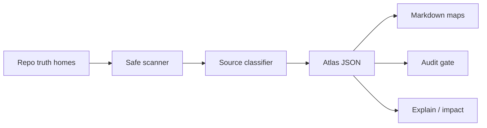

# GroundAtlas

**Source-grounded knowledge maps for humans and agents.**

GroundAtlas turns a repository into a deterministic, source-linked context map
that helps humans and AI agents understand where truth lives before changing
code. It is inspired by mature human documentation practice and agent-native
repo mapping, but it is deliberately **not** a wiki and **not** a second source
of truth.

```sh
bun install
ga init
ga audit
ga explain "validation commands"
ga impact --since main
```

The package exposes both `groundatlas` and the short daily-driver command `ga`. It also exports a typed library API from `groundatlas` for tools that want to consume the scanner, audit, renderer, explain, and impact primitives directly.

## What GroundAtlas is

- A CLI-first knowledge control plane for repositories.
- A generated navigation layer over source code, schemas, tests, ADRs,
  manifests, workflows, and docs.
- A deterministic scanner and renderer that can run in CI without model keys.
- A safe bootstrap for future agent workflows: every map points back to the
  files that own the truth.

## What GroundAtlas is not

- It is not an autonomous code writer.
- It is not an LLM memory store.
- It is not the canonical source for architecture, API contracts, project
  identity, or release status.
- It does not read secrets or `.env` files.
- It does not mutate `AGENTS.md`, `CLAUDE.md`, source files, schemas, tests, or
  ADRs.

If deleting `.groundatlas/` would remove important project truth, the project is
using GroundAtlas incorrectly.


## Final product target

GroundAtlas is building toward a complete open-source context control plane:

- source inventory across code, schemas, tests, ADRs, manifests, workflows, docs, and package metadata;
- deterministic source-grounded atlas generation;
- claim/citation graph with exact source anchors;
- query/explain answers that cite canonical files;
- impact analysis for pull requests and release work;
- freshness and citation validation gates for CI;
- Markdown/HTML output for humans and JSON output for agents/tools;
- optional AI adapters only after the deterministic map is trustworthy;
- npm library + CLI distribution with provenance.

See [Final Product Goal](./docs/specs/final-product-goal.md).

## How it works

GroundAtlas reads repository metadata through a safe scanner, classifies files by
truth-home type, builds an atlas JSON model, renders human docs, and audits the
result. Generated maps always point back to canonical source files.



See [Operating Model](./docs/specs/operating-model.md).

## Dogfooding

GroundAtlas dogfoods itself in `bun run check`: it builds the CLI, runs
`ga update` against this repository, audits the generated map, and verifies the
npm package dry-run. The repository carries `groundatlas.config.json`; generated
`.groundatlas/` output is intentionally ignored and regenerated because it is a
map, not source truth.

See [Dogfooding Contract](./docs/specs/dogfooding.md).

## Commands

| Command | Purpose |
| --- | --- |
| `ga init` | Create `groundatlas.config.json` and generated maps under `.groundatlas/`. |
| `ga update` | Refresh generated maps from current repository sources. |
| `ga scan --json` | Inspect sources without writing files. |
| `ga audit` | Verify generated maps exist and declare the non-SSOT boundary. |
| `ga explain <query>` | Find source-grounded files related to a query. |
| `ga impact --since <ref>` | Map git diff paths to known atlas sources. |

## Permission model

GroundAtlas is intentionally narrow:

- Reads repository file names and non-secret file metadata.
- Runs read-only `git` commands (`status`, `rev-parse`, `remote`, `diff`).
- Writes only:
  - `groundatlas.config.json` during `init`;
  - files inside the configured output directory, default `.groundatlas/`.
- Uses no network, no provider API, no LangSmith/tracing, and no hidden remote
  state in the MVP.

## Generated output

`ga init` / `ga update` creates:

```text
.groundatlas/
  atlas.json        # machine-readable source map
  README.md         # human/agent entry point
  source-map.md     # canonical and supporting sources
  change-guide.md   # validation and handoff guide
```

Every generated Markdown file starts with a banner that says it is generated and
not a source of truth.

## Development

```sh
bun install
bun run check
```

`bun run check` runs typecheck, tests, Biome, build, CLI help, and the local
GroundAtlas audit.

## Library publication

The package name `groundatlas` is currently available on npm, and the repository
contains a release workflow for provenance publishing. Actual npm publication is
blocked until npm trusted publishing or an npm identity/token is configured.

See [Publishing Runbook](./docs/runbooks/publishing.md).

## Status

Product-ready initial slice: deterministic CLI, typed library exports, generated
maps, audit gate, project manifest, governance docs, tests, CI, dogfooding loop,
and release workflow. npm registry publication is the next external gate.
