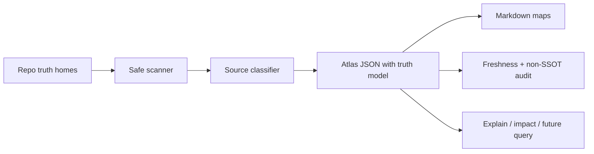

# GroundAtlas

[](https://github.com/SylphxAI/groundatlas/actions/workflows/ci.yml) [](./LICENSE)

**The source-grounded repository control plane for humans and agents.**

GroundAtlas turns a repository into a deterministic, auditable map of where
truth lives before a human or AI agent changes code. It is deliberately **not a
wiki**, **not an AI memory store**, and **not a second source of truth**. It is
the layer underneath those experiences: the map, truth routing, freshness gate,
and change-control surface that keeps generated context honest.

> OpenWiki can write a wiki. GroundAtlas tells you which source owns the truth,
> whether the generated map is fresh, and what an agent must inspect before it
> touches production code.

```sh
# Public npm install after the first registry publish/readback:
npm install -g groundatlas

# From source today:
bun install
bun run build
node dist/cli.js init
node dist/cli.js update
node dist/cli.js audit
node dist/cli.js explain "validation commands"
node dist/cli.js impact --since main
```

The package exposes both `groundatlas` and the short daily-driver command `ga`.
It also exports a typed library API from `groundatlas` for tools that want to
consume the scanner, audit, renderer, explain, and impact primitives directly.

## Why this exists

Modern teams have two bad defaults:

1. **No repo map** — knowledge lives in people, Slack, stale docs, and whatever
   an agent guesses from a partial prompt.
2. **Generated wiki as truth** — prose looks useful, then quietly becomes a
   competing authority that drifts away from code, tests, schemas, ADRs, and
   release evidence.

GroundAtlas takes the third path: generated context is useful, but canonical
truth stays in the files that own it. Delete `.groundatlas/` and no truth should
be lost.


## Open-source promise

GroundAtlas is built to be useful without buying into any vendor, model provider,
agent runtime, or company doctrine:

- core scan/audit path is deterministic;
- no network or model key is required for local/CI use;
- generated output is deletable and non-authoritative;
- project identity can live in a neutral `project.manifest.json`;
- tool-specific files such as `CLAUDE.md`, Cursor rules, or Copilot instructions
  are optional adapters, not requirements;
- future AI features must sit on top of source-owned citations, not replace them.

Started by SylphxAI, maintained as an open-source primitive: the best way to show
engineering quality is to make the useful part general enough for everyone.

## Market position

GroundAtlas is the **source-grounded repository control plane**.

It is not competing to be the prettiest wiki. It is the trust layer underneath
wikis, agents, docs sites, code search, and CI:

| Category | What it gives you | What GroundAtlas adds |
| --- | --- | --- |
| No tool | No new dependency | GroundAtlas removes tribal onboarding and agent guesswork. |
| Generated wiki | Fast prose | GroundAtlas keeps generated context subordinate to source truth. |
| Code search | Find text fast | GroundAtlas explains which files own which facts. |
| Docs site | Polished publishing | GroundAtlas audits repository truth and freshness before publishing. |
| Agent runtime | Automation | GroundAtlas gives agents a safe read order and non-SSOT boundary. |

## Value by audience

| Audience | Value |
| --- | --- |
| Users/new joiners | Start from one map and know what to read first. |
| Maintainers | Catch stale generated context and missing truth homes in CI. |
| Developer experience teams | Standardize repository onboarding without forcing a vendor stack. |
| AI agents | Use JSON/Markdown maps to find canonical files before editing. |
| Open-source communities | Share a small, inspectable convention instead of a hosted black box. |

## Project control file

For multi-project use, one neutral control file per project is the cleanest
default:

```text
project.manifest.json
```

It records stable project identity, truth-home pointers, public surfaces,
validation commands, and adoption status. GroundAtlas also recognizes
`groundatlas.project.json`, `.project/manifest.json`, and ecosystem adapters such as
`.doctrine/project.json`, but those adapters are not the public default.

See:

- [Project Control File Guide](./docs/guides/manifest-guide.md)
- [Project manifest schema](./schemas/project.manifest.schema.json)
- [Example manifest](./examples/project.manifest.json)
- [Multi-project Control Plane](./docs/specs/multi-project-control-plane.md)

## Guides

- [User Guide](./docs/guides/user-guide.md)
- [Developer Experience Guide](./docs/guides/dx-guide.md)
- [Agent Guide](./docs/guides/agent-guide.md)
- [Open-source Strategy](./docs/specs/open-source-strategy.md)
- [Control-plane Business Case](./docs/specs/control-plane-business-case.md)
- [Static landing page](./docs/website/index.html)


## 60-second demo

```sh
# First run in a repository
ga init
# GroundAtlas initialized .groundatlas/
# - .groundatlas/atlas.json
# - .groundatlas/README.md
# - .groundatlas/source-map.md
# - .groundatlas/change-guide.md

ga audit
# GroundAtlas audit passed.

ga explain "validation commands" --json
# [{ "path": "package.json", "kind": "package-manifest", ... }]

ga impact --since main
# | Status | Changed path | Matched atlas sources |

# If a canonical source changes but the map was not regenerated:
ga audit
# - error `stale-atlas`: .groundatlas/atlas.json does not match the current repository scan.
#   Run ga update and commit or regenerate the output according to repo policy.
```

The key behavior: GroundAtlas fails stale generated context instead of letting a
pretty map silently drift away from source truth.

## Current status

Product-ready initial CLI/library slice:

- deterministic scanner and atlas JSON;
- vendor-neutral `project.manifest.json` control file schema and example;
- dependency-free static landing page under `docs/website/`;
- `ga init`, `ga update`, `ga scan`, `ga audit`, `ga explain`, `ga impact`;
- explicit fact-scoped SSOT model and repository orientation route;
- generated Markdown maps with non-SSOT banners;
- freshness audit using file hashes, not just generated prose;
- secret-path skipping and narrow write boundary;
- typed library exports;
- tests, CI, dogfooding, package dry-run, packed-package smoke;
- release workflow prepared for npm provenance publishing.

External package publication is **not complete** until npm trusted publishing or
a bounded npm token is configured and `npm view groundatlas ...` readback proves
the published package.

## What GroundAtlas is

- A CLI-first knowledge control plane for repositories.
- A deterministic read-model over source code, schemas, tests, specs, ADRs,
  manifests, workflows, docs, runbooks, and package metadata.
- A fact-scoped SSOT router: it tells you which file owns which kind of truth.
- A CI-friendly audit gate for generated map integrity and freshness.
- A safe bootstrap for future agent workflows: every map points back to the
  files that own the truth.

## What GroundAtlas is not

- It is not an autonomous code writer.
- It is not an LLM memory store.
- It is not a hosted docs site.
- It is not the canonical source for architecture, API contracts, project
  identity, release status, or implementation behavior.
- It does not read secrets or `.env` files.
- It does not mutate `AGENTS.md`, tool-specific agent adapters such as
  `CLAUDE.md`, source files, schemas, specs, tests, ADRs, workflows, package
  manifests, or machine project manifests.

If deleting `.groundatlas/` would remove important project truth, the project is
using GroundAtlas incorrectly.

## Required truth files for serious adoption

GroundAtlas works best when a repository exposes real truth homes instead of
asking generated docs to invent authority.

| Surface | Required for commercial-grade repos | Owns |
| --- | --- | --- |
| `AGENTS.md` | Preferred | Tool-neutral agent adapter and repo hazards. Tool-specific adapters such as `CLAUDE.md`, `.cursor/rules`, or `.github/copilot-instructions.md` are detected when present but are not required. |
| `PROJECT.md` | Yes | Human project identity, lifecycle, boundary, public surfaces, delivery proof. |
| `project.manifest.json`, `groundatlas.project.json`, `.project/manifest.json`, or recognized ecosystem adapter | Yes for fleet/commercial governance | Machine-readable project manifest and adoption state. `.doctrine/project.json` is the SylphxAI Doctrine adapter, not the public default. |
| `README.md` | Yes | Public start-here promise and install/use contract. |
| `docs/specs/**`, `DESIGN.md`, or `design.md` | Yes | Product intent, operating contracts, acceptance criteria. |
| `docs/adr/**` | Yes once durable decisions exist | Architecture/product/security/commercial decisions. |
| `package.json`, schemas, migrations, exported types | When applicable | Commands, package/API/data contracts, machine surfaces. |
| `src/**`, `lib/**` | When applicable | Implemented behavior. |
| `test/**`, `tests/**`, evals | Yes | Behavior proof and regressions. |
| `.github/workflows/**` | Yes | CI and delivery gates. |
| `docs/runbooks/**`, `SECURITY.md`, `CHANGELOG.md` | Yes for public/customer-facing repos | Operations, security reporting, release/support status. |

GroundAtlas reads these homes, classifies them, and generates a map. It does not
replace them.

See [Source Truth Model](./docs/specs/source-truth-model.md), [Fleet Adoption
Contract](./docs/specs/fleet-adoption-contract.md), [Project Control File Guide](./docs/guides/manifest-guide.md),
and [Multi-project Control Plane](./docs/specs/multi-project-control-plane.md).

## SSOT rule

GroundAtlas uses **fact-scoped SSOT**:

- project identity lives in `PROJECT.md` plus a machine-readable project
  manifest such as `project.manifest.json`, `groundatlas.project.json`,
  `.project/manifest.json`, or a recognized adapter such as
  `.doctrine/project.json`;
- durable decisions live in ADRs;
- product intent lives in specs/design docs;
- contracts live in schemas, exported types, package manifests, and migrations;
- behavior lives in source code;
- behavior proof lives in tests/evals;
- delivery proof lives in workflows, release artifacts, registry readback,
  changelog, and runbooks;
- generated `.groundatlas/**` output is navigation only.

Conflict rule: identify the disputed fact, fix its owning source, run validation,
then run `ga update && ga audit`. Never patch generated output to hide drift.

## How it works



GroundAtlas reads repository metadata and non-secret file hashes through a safe
scanner, classifies files by truth-home type, builds an atlas JSON model, renders
human docs, and audits the result. Generated maps always point back to canonical
source files.

See [Operating Model](./docs/specs/operating-model.md).

## Commands

| Command | Purpose |
| --- | --- |
| `ga init` | Create `groundatlas.config.json` and generated maps under `.groundatlas/`. |
| `ga update` | Refresh generated maps from current repository sources. |
| `ga scan --json` | Inspect sources without writing files. |
| `ga audit` | Verify generated maps, non-SSOT boundary, schema version, error risks, and freshness. |
| `ga explain <query>` | Find source-grounded files related to a query. |
| `ga impact --since <ref>` | Map git diff paths to known atlas sources. |

Aliases: `ingest` → `scan`; `validate` → `audit`; `query` → `explain`; `map` /
`export` → `update`.

## Generated output

`ga init` / `ga update` creates:

```text
.groundatlas/
  atlas.json        # machine-readable source map and truth model
  README.md         # human/agent entry point
  source-map.md     # canonical and supporting sources
  change-guide.md   # validation and handoff guide
```

Every generated Markdown file starts with a banner that says it is generated and
not a source of truth.

## Dogfooding

GroundAtlas dogfoods itself in `bun run check`: it typechecks, tests, lints,
validates the project manifest, builds the CLI, runs the CLI against this
repository, audits generated output freshness/non-SSOT policy, verifies npm
package dry-run, and smoke-installs the packed tarball.

See [Dogfooding Contract](./docs/specs/dogfooding.md).

## Competitive position

| Choice | What you get | What you risk |
| --- | --- | --- |
| No tool | No new dependency. | Slow onboarding, tribal knowledge, stale docs, agent hallucination, weak impact analysis. |
| GroundAtlas | Deterministic source map, truth routing, freshness audit, CLI/library surface, no model key required. | Less magical prose today; citation graph and optional AI adapters are still build-forward work. |
| OpenWiki | AI-generated/maintained `openwiki/` docs and interactive documentation CLI. | Generated docs can become another truth surface; provider/model configuration is central. |
| OpenClaw | Personal AI assistant/gateway across channels, tools, apps, and skills. | Different category; powerful assistant UX but not a repo SSOT/read-model gate by itself. |
| Repo packers / code search / docs sites | Useful context snapshots, search, or polished publishing. | Usually not a project-local truth hierarchy with generated-map freshness gates. |

GroundAtlas is currently ahead on SSOT discipline, deterministic/no-key baseline,
write-boundary safety, and CI-gate posture. It is intentionally behind
LLM-first wiki tools on prose generation and provider integrations until the
source-grounded substrate is trustworthy.

See [Competitive Positioning](./docs/specs/competitive-positioning.md).

## Roadmap (not yet shipped)

Current shipped behavior is listed in [Current status](#current-status). The next
star-worthy slices are deliberately source-grounded rather than AI-magic-first:

- first npm publication with provenance and registry readback;
- richer HTML output and hosted docs/site publishing;
- claim/citation graph with exact source anchors;
- query answers that cite canonical files, not generated memory;
- deeper dependency-aware PR impact analysis;
- PR comment/report mode for CI;
- fleet dashboard from neutral `project.manifest.json` files;
- optional AI adapters only after deterministic citation gates are trustworthy.

See [Final Product Goal](./docs/specs/final-product-goal.md).

## Permission model

GroundAtlas is intentionally narrow:

- Reads repository file names, non-secret file metadata, and SHA-256 hashes of
  non-secret files for freshness detection.
- Runs read-only `git` commands (`status`, `rev-parse`, `remote`, `diff`).
- Writes only:
  - `groundatlas.config.json` during `init`;
  - files inside the configured output directory, default `.groundatlas/`.
- Uses no network, no provider API, no LangSmith/tracing, and no hidden remote
  state in the deterministic scan/audit path.

## Development

```sh
bun install
bun run check
```

`bun run check` runs typecheck, tests, Biome, build, CLI help, local GroundAtlas
update/audit, npm pack dry-run, and clean packed-package smoke.

## Library publication

The package name `groundatlas` is currently available on npm, and the repository
contains a release workflow for provenance publishing. Actual npm publication is
blocked until npm trusted publishing or an npm identity/token is configured.

See [Publishing Runbook](./docs/runbooks/publishing.md).
