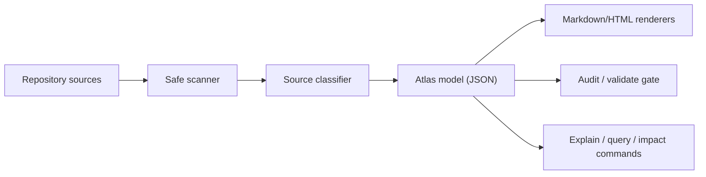

# Operating Model

GroundAtlas is a read-model over repository truth.

## Source hierarchy

GroundAtlas treats these as canonical truth homes:

1. Source code and schemas for behavior/contracts.
2. Tests/evals for expected behavior and regression proof.
3. ADRs for durable decisions.
4. `PROJECT.md` and `.doctrine/project.json` for project identity and boundary.
5. Package manifests and workflows for distribution and validation.
6. Runbooks and docs for human usage and operations.

Generated maps link to those homes. They do not override them.

## Command flow

- `ga init` writes `groundatlas.config.json` plus generated output.
- `ga scan` / `ga ingest` reads the repo and emits a source model without writes.
- `ga update` / `ga map` / `ga export` refreshes `.groundatlas/**` from current
  source truth.
- `ga audit` / `ga validate` checks that generated output exists, remains marked
  as generated, and has no hard source-boundary failures.
- `ga explain` / `ga query` finds relevant source entries for a topic.
- `ga impact --since <ref>` maps changed files to atlas entries.

## Design rules

- Deterministic core first; AI is optional adapter, never the foundation.
- No network in the MVP scan path.
- No secret reads.
- No source mutation.
- No generated-doc authority.
- CI gates must consume machine-readable outputs rather than relying on a human
  reading a dashboard.
